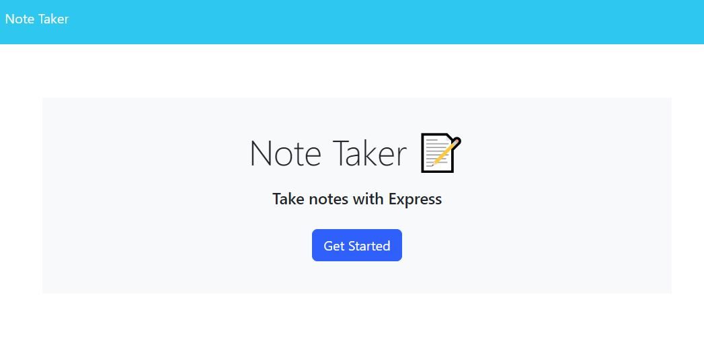
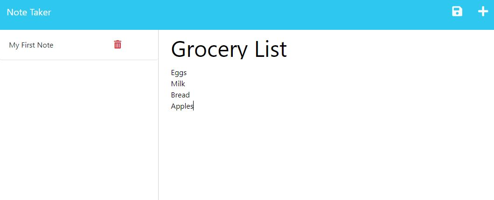

# Note Taker app
The app can be found [here](https://bc-notetaker.herokuapp.com/)

  ## Description
  This was designed to utilize Node.js, express, and other modules on static html pages to properly route user interactions.

  ## Table of Contents

  [Installation](#installation)  
  [Usage](#usage)  
  [Questions](#questions)  
  

  ## Installation
  No installation necessary.

  ## Usage
  Simply hit the 'Get Started' button to start taking notes.  Click the floppy disk to save a note.
  
  ## Questions
  [AForkintheCode](http://www.github.com/AForkintheCode)
